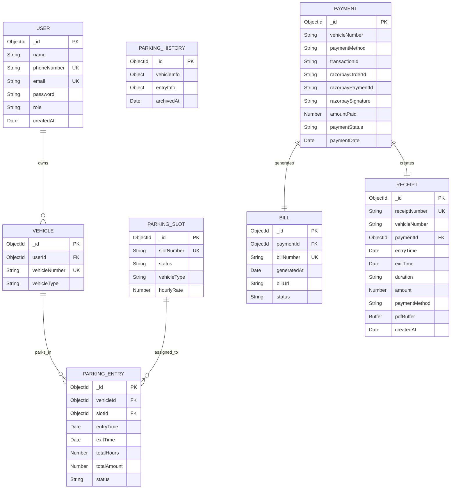

# Parking Management System - Database ER Diagram

## Entity Relationship Diagram

## Entity Details

### USER
- **Primary Key**: _id (ObjectId)
- **Unique Keys**: phoneNumber, email
- **Attributes**:
  - name: User's full name
  - phoneNumber: Contact number (unique)
  - email: Email address (unique, optional)
  - password: Encrypted password
  - role: User role (customer, staff, admin)
  - createdAt: Account creation timestamp

### VEHICLE
- **Primary Key**: _id (ObjectId)
- **Foreign Key**: userId → USER._id
- **Unique Keys**: vehicleNumber
- **Attributes**:
  - vehicleNumber: License plate number (unique)
  - vehicleType: Type of vehicle (car, bike, truck)

### PARKING_SLOT
- **Primary Key**: _id (ObjectId)
- **Unique Keys**: slotNumber
- **Attributes**:
  - slotNumber: Slot identifier (unique)
  - status: Slot availability (available, occupied, maintenance)
  - vehicleType: Compatible vehicle type (car, bike, truck)
  - hourlyRate: Parking rate per hour

### PARKING_ENTRY
- **Primary Key**: _id (ObjectId)
- **Foreign Keys**: 
  - vehicleId → VEHICLE._id
  - slotId → PARKING_SLOT._id
- **Attributes**:
  - entryTime: Vehicle entry timestamp
  - exitTime: Vehicle exit timestamp
  - totalHours: Duration of parking
  - totalAmount: Total parking fee
  - status: Entry status (active, completed)

### PARKING_HISTORY
- **Primary Key**: _id (ObjectId)
- **Attributes**:
  - vehicleInfo: Embedded vehicle details
  - entryInfo: Embedded parking session details
  - archivedAt: Archive timestamp

### PAYMENT
- **Primary Key**: _id (ObjectId)
- **Attributes**:
  - vehicleNumber: Associated vehicle
  - paymentMethod: Payment type (razorpay, cash)
  - transactionId: Payment transaction ID
  - razorpayOrderId: Razorpay order identifier
  - razorpayPaymentId: Razorpay payment identifier
  - razorpaySignature: Payment verification signature
  - amountPaid: Payment amount
  - paymentStatus: Status (pending, completed, failed)
  - paymentDate: Payment timestamp

### BILL
- **Primary Key**: _id (ObjectId)
- **Foreign Key**: paymentId → PAYMENT._id
- **Unique Keys**: billNumber
- **Attributes**:
  - billNumber: Unique bill identifier
  - generatedAt: Bill generation timestamp
  - billUrl: PDF bill file location
  - status: Bill status (issued, cancelled)

### RECEIPT
- **Primary Key**: _id (ObjectId)
- **Foreign Key**: paymentId → PAYMENT._id
- **Unique Keys**: receiptNumber
- **Attributes**:
  - receiptNumber: Unique receipt identifier
  - vehicleNumber: Associated vehicle
  - entryTime: Parking start time
  - exitTime: Parking end time
  - duration: Parking duration string
  - amount: Total amount paid
  - paymentMethod: Payment method used
  - pdfBuffer: Receipt PDF binary data
  - createdAt: Receipt creation timestamp

## Relationships

1. **USER → VEHICLE** (One-to-Many)
   - One user can own multiple vehicles

2. **VEHICLE → PARKING_ENTRY** (One-to-Many)
   - One vehicle can have multiple parking sessions

3. **PARKING_SLOT → PARKING_ENTRY** (One-to-Many)
   - One parking slot can be used for multiple sessions

4. **PAYMENT → BILL** (One-to-One)
   - Each payment generates one bill

5. **PAYMENT → RECEIPT** (One-to-One)
   - Each payment creates one receipt

## Business Rules

- Users must register before parking vehicles
- Vehicle numbers must be unique across the system
- Parking slots are type-specific (car, bike, truck)
- Active parking entries cannot overlap for the same vehicle
- Payments are required before vehicle exit
- Bills and receipts are automatically generated after payment
- Parking history maintains archived records for reporting